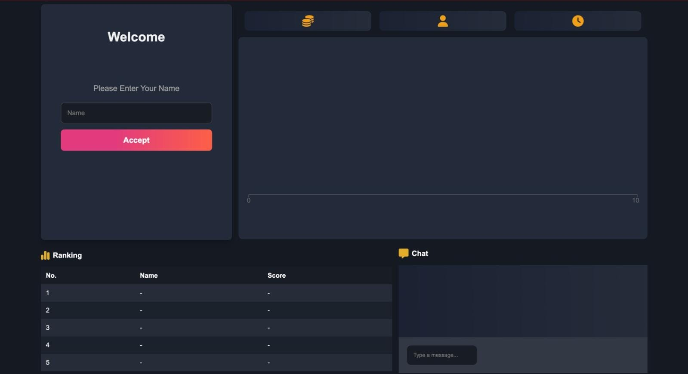
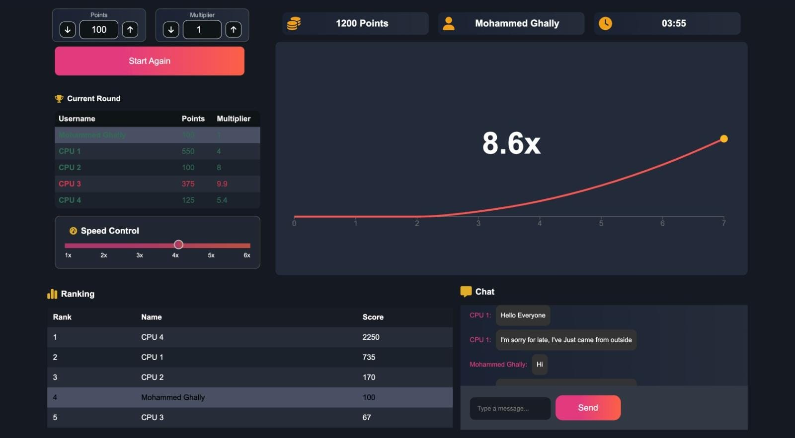

<div align="center">
  <h2>Guess Wave</h2>
  
  <h3>
    <a href="https://guesswave.netlify.app" target="_blank">
      <strong>Demo Website</strong>
    </a>
  </h3>
  <div align="center">
    <a href="https://guesswave.netlify.app" target="_blank">View Demo</a>
  </div>
  <hr>
</div>

<!-- Brief -->
<p align="center">
Guess Wave is an engaging and dynamic guessing game where players predict the point at which a rising multiplier value will freeze. The game progresses through multiple rounds, challenging players to place points based on their predictions. The objective is to win by correctly guessing the freeze point and multiplying their points.
</p>

<!-- Screenshot -->
<a align="center" href="https://guesswave.netlify.app">





</a>

Table of contents

- [Key Features](#key-features)
- [Built With](#built-with)
- [Installation](#installation)
- [Author](#author)

Key Features

- Players can enter their username to start the game.
- Users can place points and choose a multiplier for each round.
- Real-time game progress visualization with WebSockets.
- Interactive and responsive user interface.
- Dynamic multiplier chart updating in real-time.
- Leaderboard showing the ranking of players.
- Chat functionality for players to communicate during the game.
- Adjustable game speed to control the round duration.

Built With

- Typescript
- ReactJS
- NextJS
- WebSocket
- SCSS

Installation

- Clone this repo:

```sh
git clone https://github.com/mghally999/guesswave.git
```
